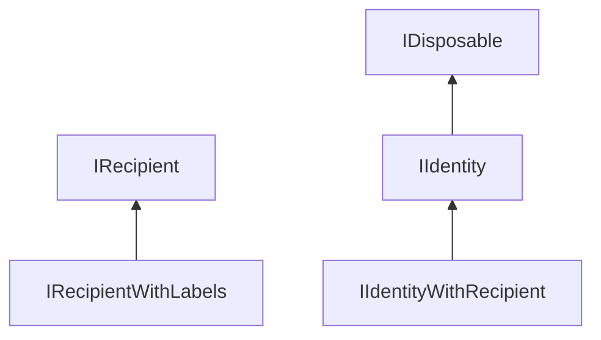
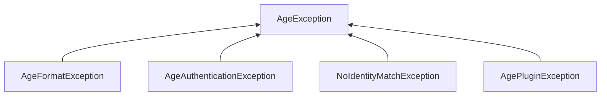
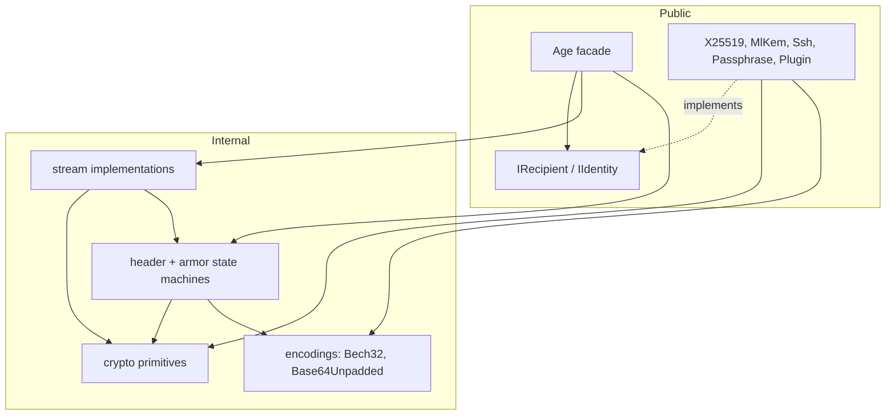

# Type map

Sixty-three types: **27 public**, **36 internal**. This is the inventory — what a consumer can touch,
what is implementation detail, and which depends on which. For the behavioural rules (stream
ownership, secret hygiene, sync/async parity) see [CLAUDE.md](../CLAUDE.md).

---

## Public surface (27)

Everything public lives in the flat `AgeSharp` namespace.

### The facade — 1 type

`Age` — a `static partial class` split across four files: `Age.cs` (the synchronous surface),
`Age.Async.cs` (`*Async` counterparts), `Age.Parsing.cs` (`ParseRecipient`/`ParseIdentity`), and
`Age.Header.cs` (building and taking apart a header, plus argument validation).
Every operation enters here. It is the only public type that *does* anything; the rest are
contracts, data, or key material.

### Contracts — 5 interfaces

| Interface | Purpose |
|---|---|
| `IRecipient` | Wrap a file key into one or more `Stanza`s. One method. |
| `IRecipientWithLabels : IRecipient` | Opt-in: also return a security label set from the wrap. |
| `IIdentity : IDisposable` | Fill a caller-supplied span with the file key, or return false. `Dispose` has a default no-op. |
| `IIdentityWithRecipient : IIdentity` | Opt-in: derive the matching public recipient. |
| `IPluginCallbacks` | Host hooks for age plugins (prompts, secrets). |

The capability pattern is deliberate: the *optional* halves are separate interfaces rather than
members, so a custom type implements only what it can honour, and the facade feature-tests with
`is IRecipientWithLabels`.

### Key material — 11 types

Five recipient/identity pairs plus `Passphrase`, which is its own inverse.

| Recipient | Identity | Notes |
|---|---|---|
| `X25519Recipient` | `X25519Identity` | native age `age1…` / `AGE-SECRET-KEY-1…` |
| `MlKem768X25519Recipient` | `MlKem768X25519Identity` | post-quantum; the only labelled recipient |
| `SshEd25519Recipient` | `SshEd25519Identity` | SSH key bridge |
| `SshRsaRecipient` | `SshRsaIdentity` | SSH key bridge, RSA-OAEP |
| `PluginRecipient` | `PluginIdentity` | delegates to an external age plugin |
| `Passphrase` — implements **both** `IRecipient` and `IIdentity`; scrypt. Must be a file's only recipient. |

Which optional interfaces each implements:

- `IRecipientWithLabels` — only `MlKem768X25519Recipient`
- `IIdentityWithRecipient` — the four key-based identities, plus `PluginIdentity` (which defers to the plugin rather than deriving anything)
- `IParsable<T>` — the four bech32 types (`X25519Recipient/Identity`, `MlKem768X25519Recipient/Identity`)
- `IDisposable` explicitly — the four identity types holding secret bytes

`Passphrase` implements no optional interface: it has no public half and carries no labels.

### Data and configuration — 5 types

- `Stanza` — one recipient stanza: type, args, body. The unit both `IRecipient` and `IIdentity` speak in.
- `LabelledStanzas` — what `WrapWithLabels` returns: the stanzas plus their label set. A struct rather than a record, since value equality over a collection would compare references.
- `AgeHeader` — result of `Age.ReadHeader`: stanzas, payload offset, whether armored. **Unverified** — no MAC has been checked, so treat its contents as attacker-controlled.
- `AgeEncryptOptions` — one member, `Armor`.
- `AgeDecryptOptions` — `RequireArmor` plus the three parsing limits.

### Exceptions — 5 types

`AgeException` is the base; catch it to catch everything the library throws deliberately.

`AgeFormatException` means malformed input; `AgeAuthenticationException` means a MAC or AEAD check
failed, which includes truncation.

---

## Internal implementation (36)

### Streams (9) — the four grid cells plus their armor and payload layers

All derive from `System.IO.Stream`. None is ever handed out as its own type; the facade returns
them as `Stream`.

| Type | Role |
|---|---|
| `EncryptStream` | pull encrypt: produces ciphertext as the caller reads |
| `DecryptStream` | pull decrypt, forward-only |
| `SeekableDecryptStream` | pull decrypt, random access; authenticates plaintext length up front |
| `EncryptWriterStream` | push encrypt |
| `DecryptWriterStream` | push decrypt; the only one with lazy setup |
| `ArmorStream` / `ArmorWriterStream` | add armor, pull / push |
| `DearmorStream` | strip armor, pull |
| `PeekableStream` | lookahead over a non-seekable source, for armor detection |

### Format state machines (5) — sans-I/O, byte-fed, never touch a stream

`HeaderLineAccumulator`, `HeaderReader`, `Header` (parse + MAC), `ArmorLineAccumulator`,
`ArmorDecoder`, and its counterpart `ArmorEncoder`. These are why the sync and async paths — and
the pull and push paths — share their logic.

Plus `ArmorGeometry` (O(1) binary-offset → text-position translation), `ArmorFormat` (the shared
markers and line geometry), and `AsciiArmor` (detection and the armor/dearmor entry points).

### Crypto (9)

`StreamEncryption` (STREAM chunking), `CryptoHelper` (HKDF, ChaCha, the single X25519 agreement
path), `XWing` (ML-KEM-768-X25519), `HpkeHelper`, `Ed25519Converter`, `SshKeyParser`, and the AEAD
backend switch: `IAeadCipher` with `BclAeadCipher` / `BouncyCastleAeadCipher`, selected by
`AeadCipher` per `AeadBackend`.

### Encodings and helpers (5)

`Bech32`, `Base64Unpadded`, `ParseHelpers`, `AgeProtocol` (stanza type strings and HKDF labels),
`PluginNameValidator`. Plus `PluginConnection` for the plugin wire protocol and `PluginProtocol`
for the parts of it that recipient-v1 and identity-v1 share.

---

## Who relies on what

Two things this diagram gets right that the folder names do not:

**`Crypto/` and `Format/` are not layers.** They reference each other. `Format/Header.cs` uses
`CryptoHelper` for the header MAC, and `Format/Stanza.cs` uses `Base64Unpadded`; going the other
way, `Crypto/DecryptWriterStream.cs` uses `HeaderReader`, `ArmorLineAccumulator`, `ArmorDecoder`,
and `AsciiArmor`, because push-decryption does its own framing. Read the folders as buckets, not
as a dependency order.

**`Bech32` and `Base64Unpadded` live under `Crypto/` but are encodings, not cryptography.** Twelve
of the seventeen files in `Recipients/` reach into `Crypto/`, and much of that traffic is these
two. If the folders are ever reorganised, these are the types that belong somewhere neutral.

**The facade never touches primitives directly.** `Age` constructs streams and the header reader;
it does not call `StreamEncryption` or `AeadCipher`. Key derivation reaches `CryptoHelper` only for
`HkdfDerive` on the payload key.

---

## Where to start reading

1. `Age/Age.cs` — the facade, every entry point; `Age.Header.cs` for the work behind it.
2. `Age/Recipients/IRecipient.cs` and `IIdentity.cs` — the two contracts everything else serves; about 40 lines together.
3. `Age/Recipients/X25519Recipient.cs` and `X25519Identity.cs` — the simplest complete pair, and the model the others follow.
4. `Age/Crypto/StreamEncryption.cs` — the STREAM chunking every payload path shares.
5. Then whichever grid cell you are changing.
